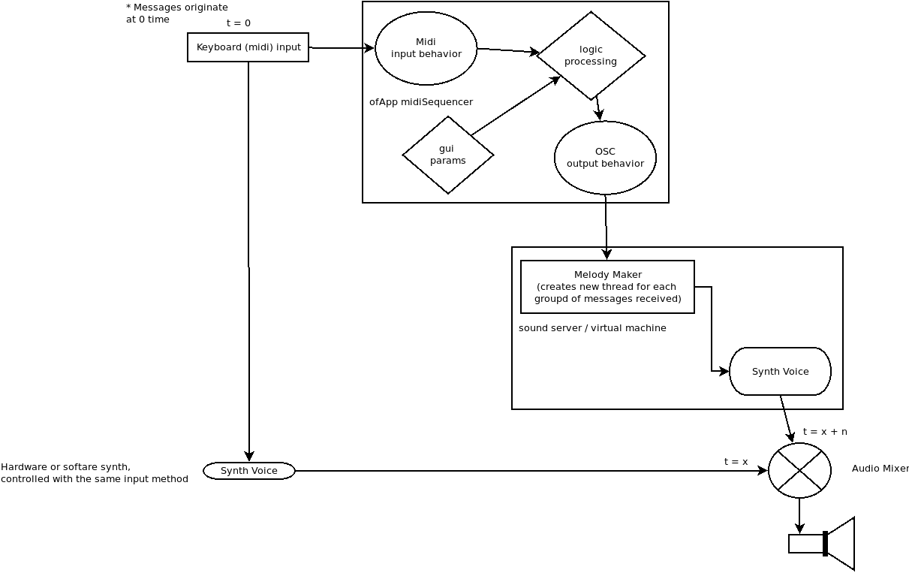

## midi Sequencer v0.1.1

A simple openFrameworks project that generates a four note midi sequence given
a note in. 
+ Harmonies in the sequence can be controlled via modename and root selection
+ Rhythmic proportions controlled via position of the HarmonicFields along the
  x axis
+ Probability of a specific step controlled by position along the y axis


## Compilation 

```
cd $OFROOT/apps/myApps/
git clone git@github.com:adammccartney/midiSequencer.git
cd midiSequencer 
make
make RunRelease
```

## Usage



It's intended to be used as a single component in a modular toolchain. midi
Sequencer receives notes from a midi port and communicates the generated
sequencer over OSC to some other program (chuck/supercollider/puredata), 
which then might do something useful (like make some control messages 
for an instrument). 


