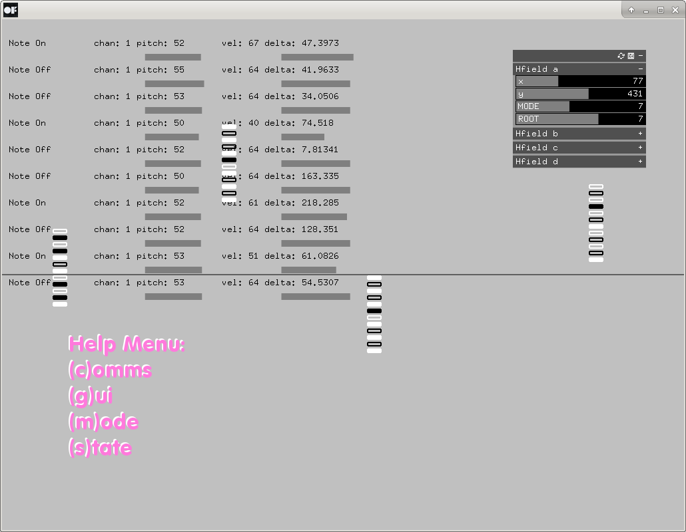

## midi Sequencer


A simple openFrameworks project that generates a four note midi sequence given
a note in. 
+ Harmonies in the sequence can be controlled via modename and root selection
+ Rhythmic proportions controlled via position of the HarmonicFields along the
  x axis
+ Probability of a specific step controlled by position along the y axis



***currently a pre-release and nder heavy construction***

## Compilation 

```
cd $OFROOT/apps/myApps/
git clone git@github.com:adammccartney/midiSequencer.git
cd midiSequencer 
make
make RunRelease
```

# Usage

It's intended to be used as a single component in a modular toolchain. midi
Sequencer receives notes from a midi port and communicates the generated
sequencer over OSC to some other program (chuck/supercollider/puredata), 
which then might do something useful (like make some control messages 
for an instrument). 

## Todo
27. April 2021
+ fix segfault after integrating unit tests
   - eliminate any leftover calls to mock functions in HarmonicFieldGraph 

23. April 2021
+ ~~implement and test getters for Note relative time and probabilty members~~
+ integrate unit tests
+ get gui to talk to logic structure for segments (selecting harmonies)
+ fire a tracer bullet and check that you haven't just built a pile of pooh

22. April 2021
+ ~~Figure out what's causing the segfault in the call to
  QuantizedPitchManager::processMidiNote(const int &midVal)~~

20. April 2021
+ ~~finish design of HarmonicFieldManager and QuantizedPitchManager,
  implement~~
+ ~~figure out relationships needed to connect up~~
  - ~~HarmonicField | HarmonicFieldManager QuantizedPitchManager | OscMessage~~

19. April 2021
+ ~~reformat unit tests to use Google Tests~~ (turns out a giant corporation
  does at least one thing right)

14. April 2021
+ ~~Design + implement behavior model for sender~~
+ ~~Design behavior model for receiver~~

9. April 2021
+ ~~Create enum pitchclass~~
+ ~~Ammend construction of harmonic field graphs so they don't overlap~~
+ ~~Convert python code into HarmonicField logic class~~

8. April 2021
+ ~~Create a timeline and section it according to the number of harmonic
  fields~~
